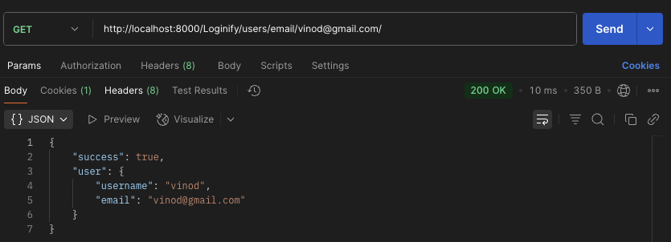
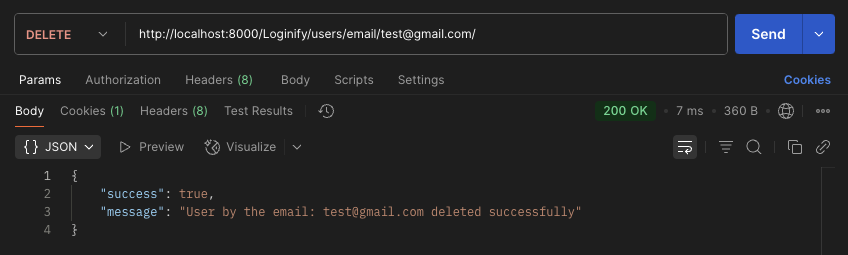

# Django Project - Login System

This Django project is a simple user management system with signup, login, session-based authentication, and CRUD operations using Django views and JSON responses.

It includes user registration, authentication, listing users, retrieving, updating, and deleting user details.

---

## ✅ Features

- User Signup (HTML form)
- User Login with sessions
- Protected Home page
- List all users (JSON API)
- Get user by email (JSON API)
- Update user by username (JSON API)
- Delete user by email (JSON API)

---

## 🗂️ Models

```python
class UserDetails(models.Model):
    username = models.CharField(max_length=50, primary_key=True)
    email = models.EmailField(unique=True)
    password = models.CharField(max_length=12, blank=True)
```

✅ `username` → primary key  
✅ `email` → unique field

---

## 📑 Forms

- **SignUpForm**: ModelForm for UserDetails
- **LogInForm**: Standard Form with email and password

---

## 🔗 URL Patterns

**Loginify/urls.py**

| Method | Path                    | View Function        | Description                    |
| ------ | ----------------------- | -------------------- | ------------------------------ |
| GET    | `/signup/`              | signup               | Signup page                    |
| POST   | `/signup/`              | signup               | Create new user                |
| GET    | `/login/`               | login                | Login page                     |
| POST   | `/login/`               | login                | Authenticate and start session |
| GET    | `/home/`                | home                 | Home page (requires session)   |
| GET    | `/users/`               | get_all_users        | List all users (JSON)          |
| GET    | `/users/email/<email>/` | user_detail_by_email | Get user by email (JSON)       |
| DELETE | `/users/email/<email>/` | user_detail_by_email | Delete user by email (JSON)    |
| PATCH  | `/users/<username>/`    | user_detail_by_id    | Update user by username (JSON) |

---

## ⚙️ API Example Usage

✅ **List all users**

```bash
GET /users/
```


✅ **Get single user by email**

```bash
GET /users/email/user@example.com/
```



✅ **Update user by username**

```bash
PATCH /users/username/
Content-Type: application/json

{
    "email": "new@example.com"
}
```

.png>)

✅ **Delete user by email**

```bash
DELETE /users/email/user@example.com/
```



---

## 🔐 Session-based Login

- User logs in via `/login/`
- Session stores username
- Home page requires session

---

## ⚠️ Notes

- CSRF is disabled for JSON API endpoints (`@csrf_exempt`). For production, use CSRF protection and proper authentication.
- Passwords are stored in plain text for this assignment (not secure for real applications).
- Forms use Django's built-in validation.

---

## 🚀 Setup Instructions

1️⃣ Clone or download this project.  
2️⃣ Create a virtual environment:

```bash
python -m venv venv
source venv/bin/activate  # or venv\Scripts\activate on Windows
```

3️⃣ Install dependencies:

```bash
pip install -r requirements.txt
```

4️⃣ Run migrations:

```bash
python manage.py migrate
```

5️⃣ Start the server:

```bash
python manage.py runserver
```

6️⃣ Access the site at:

```
http://127.0.0.1:8000/
```

---

## ✅ License

This project is for educational purposes only.
